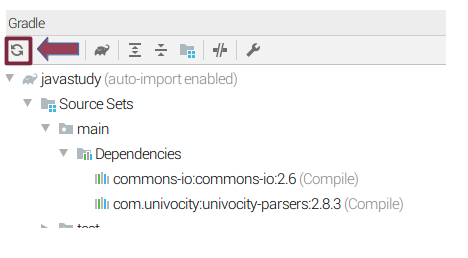

# 사실은 되게 유용한 자바 프로젝트(2)


## 지난 시간 복습

IntelliJ에서 원클릭기능으로 distZip해보기

$ unzip build/distributions/*.zip

 unzip한 후 exe 파일 실행해보기

빌드가 모다? executable file 또는 executable file을 만드는 과정!


## wordTsvParser 만들기

### 사전작업

1. Maven repository에서 UniVocity Parsers 검색해서 가져오기

   - https://mvnrepository.com/
   - gradle 내용 복사하기

2. build.gradle에 import 해주기

   1. gradle 내용 붙여넣기
      ```groovy
   dependencies {
       testCompile group: 'junit', name: 'junit', version: '4.12'
       // https://mvnrepository.com/artifact/commons-io/commons-io
       compile group: 'commons-io', name: 'commons-io', version: '2.6'
   
       // https://mvnrepository.com/artifact/com.univocity/univocity-parsers
       compile group: 'com.univocity', name: 'univocity-parsers', version: '2.8.3'
      }
      ```
   

   2. IntelliJ oneclick 기능에서 gradle import 버튼을 클릭한다./home/migu/.config/Typora/typora-user-images
   
      (IntelliJ가 auto import를 물어볼때 허용했으면 안해도 되지만 난 성격이 급하니까!)
      
      

### **브랜치 따서 리팩토링하기**

지난 시간에 한 것은 특정 커밋 해쉬값으로 HEAD의 이동 없이 잠깐 그 커밋으로 이동했다가, 그 커밋에서 branch를 생성하여 HEAD를 이동 시킨후 wordTsvParser를 개발하였다.

1. **git log --oneline**: 커밋 메세지와 매핑된 커밋 해쉬값을 확인한다.

2. **git checkout <커밋 해쉬값>**:특정 커밋으로 이동한다. HEAD가 이동한 것은 아니다.(headless)

3. **git checkout -b <브랜치 이름>**:지금 위치하고 있는 커밋에서 새로운 브랜치를 만든다. 

   


### 튜토리얼 참고해서 tsv 파싱 로직 작성하기:BasicTsvParser

https://www.univocity.com/pages/univocity_parsers_tsv.html#working-with-tsv

외부 라이브러리 사용법 스스로 공부하는 연습하기!!!!!!

```java
TsvParserSettings settings = new TsvParserSettings();
settings.getFormat().setLineSeparator("\n");

// creates a TSV parser
TsvParser parser = new TsvParser(settings);

// parses all rows in one go.
List<String[]> allRows = parser.parseAll(getReader("/examples/example.tsv"));
```

UniVocity Parser의 Tsvparser 기본적인 사용법은 

parser setting을 정해주기

-> Tsv 파서를 생성

 -> 문자열 어레이에 line separator 기준으로 잘라서 넣기이다.

### **Java Collection Framework 사용하기**

자바의 대표적 콜렉션 구현체는 ArrayList와  Hashmap으로, 해당 콜렉션들의  특징과 사용법을 알고 있으면 

다양한 상황에 유용하게 쓸 수 있다.

> ArrayList는 

여러 타입을 가질 수 있는 동적배열이고, add, remove,get(index i) 등의 함수가 대표적이다.

> Hashmap은 

key-value pair로 이루어져 있어 키값을 통한 검색 속도가 O(1)이다. put, remove가 기본적으로 쓰인다. 더 나아가 entrySet, keySet 등의 함수를 자유자재로 사용할 수 있다면 람다식을 사용할 때도 편리하다.

(람다식은 추후에 언급할 예정이고, ArrayList, Hashmap에 대한 심화적 사용도 스터디 시간에 다룰 예정이다.)

또한, 해당 collection들을 print할 때는 enhanced loop나 for each를 사용하는 것이 코딩시 편리하다.

```java
for(String string: wordList)
{
    System.out.println(string);
}

wordList.forEach(s->{ System.out.println(s);});
```


이때까지 설명한 내용을 코드로 표현하면 다음과 같다.(친절한 주석이 달린 린구 코드!)

```java
public class BasicTsvParser {
    List<String[]> allRows;

    public BasicTsvParser() {
        allRows = new ArrayList<>();
    }

    public void readTSV() {
        TsvParserSettings settings = new TsvParserSettings();
        settings.getFormat().setLineSeparator("\n");

        // creates a TSV parser
        TsvParser parser = new TsvParser(settings);

        // parses all rows in one go.
        allRows = parser.parseAll(new File("output-onlinerandomtools.tsv"));
    }

    public void printTSV() {
        for(String[] arr1 : allRows)
            for(String arr2 : arr1){
                System.out.println(arr2);
            }
    }
}
```


### 상속 복습하기

일반 클래스나 추상 클래스를 상속 받을 땐 extends 키워드를 사용하여 부모 클래스의 멤버변수와 메소드를 물려받는다. 정확히 말해서 부모의 'private이 아닌' 멤버변수와 메소드를 사용할 수 있게 된다. 

super()를 호출하는 것이 그런 과정이라고 생각하면 된다. 또한 부모와 동일한 이름을 가졌지만 기능에 있어서는 상이하거나 특별한 기능을 구현할 경우 @Override annotation을 사용하여 이를 표시한다.


### BufferedReader와 FileReader

FileReader와 BufferedReader는 아주 자주 같이 쓰인다. 파일리더가 파일에 접근하는 것을 도와주고 BufferedReader가 파일을 읽어오는데에 여러가지 유용한 기능을 제공하기 때문이다. 일단 한 줄씩 읽는 경우에 BufferedReader를 쓰는 것이 좋다.

1. 읽을 파일 경로(상대,절대 둘다 됨)를 파일리더의 파라미터로 넘겨서 파일리더를 생성한다.
2. 버퍼드리더의 파라미터로 파일리더를 넘겨 버퍼드리더를 생성한다.


지금 까지 설명한 내용을 코드로 표현하면 다음과 같다.

```java
public class WordTsvParser extends BasicTsvParser {
    ArrayList<String> wordList;
    private BufferedReader bu/home/migu/.config/Typora/typora-user-imagesfferedReader;
    private FileReader fileReader;
    private TsvParser tsvParser;
    
public WordTsvParser() {
    super();
    wordList = new ArrayList<String>();
/home/migu/.config/Typora/typora-user-images/home/migu/.config/Typora/typora-user-images
    TsvParserSettings settings = new TsvParserSettings();
    settings.getFormat().setLineSeparator("\n");

    tsvParser = new TsvParser(settings);
}

@Override
public void readTSV() {
    try {
        fileReader = new FileReader("output-onlinerandomtools.tsv");
    }
    catch (FileNotFoundException e) {
        e.printStackTrace();
    }

    bufferedReader = new BufferedReader(fileReader);/home/migu/.config/Typora/typora-user-images

    allRows = tsvParser.parseAll(bufferedReader);

    for(String[] strings:allRows) {
        for (String string : strings)
        {
            if(string.length()< 5)
            {
                wordList.add(string);
            }
        }
    }
}caption

@Override
public void printTSV() {
    System.out.println("wordList");
    System.out.println("======================");

    for(String string: wordList)
    {
        System.out.println(string);
    }
}
}
```


+++++++

### **git 저장소에서 모든 브랜치 가져오기**

아래의 내용은 스터디 시간에 잠깐 나온 이야기를 정리한 것이다.

원격 저장소에서 clone을 해오면 master branch만 받아오게 되는데, -a 옵션을 사용하면 숨겨져 있는 브랜치를 볼 수 있고, 해당 브랜치를 localize할수도 있다. 아래는 실제로 branch localize를 실행해본 것이다. 

```text
/home/migu/.config/Typora/typora-user-images/home/migu/.config/Typora/typora-user-imagesmigu@migu-desktop:~/git$git clone [remote_repo_address]
migu@migu-desktop:~/git$cd [project_dir]

migu@migu-desktop:~/git/tsvparser$ git branch
* master
migu@migu-desktop:~/git/tsvparser$ git branch -a
* master
  remotes/origin/HEAD -> origin/master
  remotes/origin/master
  remotes/origin/wordTsv
  remotes/origin/wordtsv
migu@migu-desktop:~/git/tsvparser$ git checkout origin/wordtsv 
주의: 'origin/wordtsv' 체크아웃하기.

지금 'HEAD가 분리된' 상태입니다. 이 상태에서는 여기저기 돌아보고,
실험적으로 바꾸고 커밋하더라도, 체크아웃할 수 있는 다른 브랜치에
영향을 미치지 않고 변경 사항을 잃어버릴 수 있습니다.

커밋을 유지하는 브랜치를 새로 만드려면, (지금이든 나중이든) 체크아웃/home/migu/.config/Typora/typora-user-images
명령을 다시 하면서 -b 옵션을 사용하면 됩니다. 예를 들어:

  git checkout -b <새-브랜치-이름>

HEAD의 현재 위치는 c81ec9f Implemented TSV file parser using collection & external library
migu@migu-desktop:~/git/tsvparser$ git checkout wordtsv
'wordtsv' 브랜치가 리모트의 'wordtsv' 브랜치를 ('origin'에서) 따라가도록 설정되었습니다.
새로 만든 'wordtsv' 브랜치로 전환합니다
migu@migu-desktop:~/git/tsvparser$ git branch
  master
* wordtsv
```


+++++

### IntelliJ  오늘의 단축키

Shift+F10 :가장 최근에 실행한 작업 실행

ex) main 함수 실행 