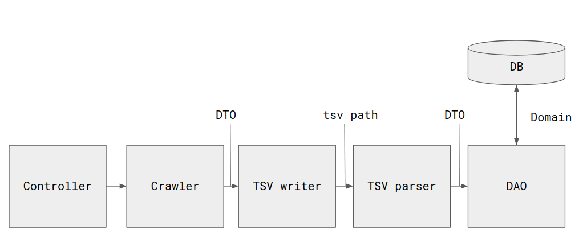

# 사실은 되게 유용한 자바 프로젝트(3)

> start from this commit : a5f23ae9cc

오늘은 완성할 프로젝트 요소에 대해 이해한 후 그에 맞게 패키징을 해볼 겁니다.

## 패키징 하기

패키징은 쉽게 말해 문서 폴더 구조짜는 것이라고 볼 수 있습니다. 보통 기능별로 나눕니다.


### 패키징의 장점은?

먼저 앞서 말한 것처럼 기능별로 분류되어 개발자 입장에서 접근이 용이합니다. 
또 패키지를 나누면 동일한 이름의 클래스가 각자 다른 패키지에 존재하므로 클래스이름에 있어서 충돌이 나지 않습니다. 

import를 통해 패키지를 참조하여 사용하면 되니까요.

물론 아래와 같이 쓰면 충돌 나는게 당연할 겁니다.

```java
import apackage.Aclass;
import bpackage.Aclass;
// 인텔리제이의 불평: apackage.Aclass is already defined in a single-type import
```

동일한 이름을 가진 다른 패키지에 존재하는 클래스 두 개를 모두 사용하기 위해서는 하나는 절대 경로 접근하듯이 쓰거나 두 개 모두 절대 경로 접근하는 방식으로 써야 할 것입니다. 

```java
apackage.Aclass = new apackage.Aclass();
bpackage.Aclass = new bpackage.Aclass();
```

하지만 가능하면 동일한 이름을 가진 클래스는 만들지 않는 것이 좋다고 생각합니다.


### 패키지 이름은 어떻게 짓는가?

  패키지는 보통 여러 개의 서브 패키지가 hierarchical하게 연결됩니다. 다음과 같이 범위가 큰 것에서 작은 것으로 좁혀집니다. 


  ``` java
  import org.springframework.data.domain.Page; 
  ```

  이는 package naming convention과도 연관이 있는데,

  자세한 내용은 [오라클 공식 튜토리얼 문서](https://docs.oracle.com/javase/tutorial/java/package/namingpkgs.html) 를 참조하면 되겠습니다.


### 프로젝트의 목표와 프로그램 플로우를 먼저 알자

먼저 controller에서 작업들을 제어합니다.

(DTO와 DAO, Domain에 대한 설명은 추후에 자세히 하겠습니다. 지금은 DTO와 Domain이 각 중요 기능 사이에서 데이터를 실어 나르는 데이터 객체라고 간단히 설명하겠습니다. DAO는 DB에 접근하는 객체입니다.)

1. Crawler가 웹 사이트를 크롤링하고 그 결과를 DTO 형태의 리스트로 반환합니다.
2. TSV writer가 Crawler부터 DTO 리스트를 받아서 TSV 형태의 파일을 만들어냅니다.
3. TSV parser가 TSV writer로부터 TSV 파일의 경로를 받아와 읽습니다.
4. DAO가 TSV parser로부터 (TSV 파일을 읽으면서 만들어낸) DTO 리스트를 받아와 Domain의 형태로 DB에 저장하고, 저장한 결과를 읽어옵니다.)
5. DB에 저장한 결과에 대한 조회가 이루어집니다.   
6. DB에 저장한 결과에 대한 다양한 분석이 이루어집니다.(TODO)



위의 그림과 설명을 큰 그림의 측면에서 충분히 이해하시길 바랍니다.  

### 이제 패키징을 해보자!

이 프로젝트에서는 naming convention에 충실하기 보다는 기능적 분류에 충실하여 패키징을 해보겠습니다. 

util package에서 오른쪽 마우스를 클릭하여 analyzer package, crawler package, tsv packge를 추가합니다. 이런 식으로 다른 패키지들도 추가해봅니다. 최종적인 패키지 구조는 다음과 같습니다.

- util
  - analyzer
    - dao
  - crawler
  - tsv
    - writer
    - parser
- data
  - dto
  - domain
- config	


**오늘의 단축키**: 메인 함수가 있는 클래스에서 Ctrl + Shift + F10를 누르면 프로그램을 실행해줍니다.

