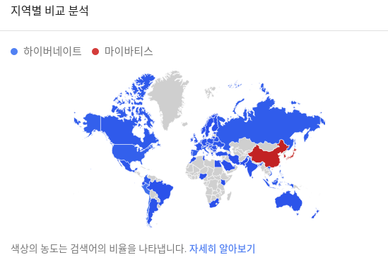
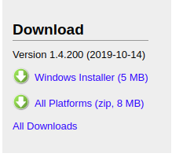
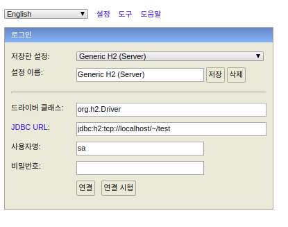
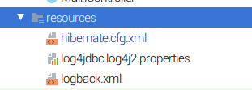
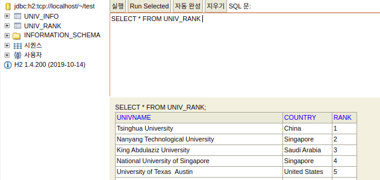

# 사실은 되게 유용한 자바 프로젝트(5)

> start from this commit : cf0e9105

와! 드디어 마지막 시간입니다. 아직 얘기할 것은 산더미 같이 남아있긴 합니다.  

1. tsv writer와 tsv parser 코드에 대한 설명
2. Java의 Collection과 Lambda의 활용 
3. Logger 사용하기
4. JUnit으로 테스트 코드 작성하기
5. 개발자 도구에서 콘솔창 사용하기
6. 등등...

하지만 글로 내용을 전달하기란 정말 쉽지 않다는 것을 깨닫는 시간이었습니다. ~~퇴고는 이제 그만하고 싶습니다.~~

스터디에서 했던 내용을 먼저 끝내고 힘이 닿는 대로 추가적인 내용을 정리해보도록하겠습니다. 

오늘은 구현한 크롤러의 결과를 DB에 저장해보겠습니다.

## 크롤러의 결과 DB에 저장

### DAO와 DTO

지난번에 패키징시간에 프로그램 플로우에 대해서 언급했습니다. 그러면서 DTO 객체와 DAO 객체에 대해서 간단히 언급하고 넘어갔습니다. 그런데 두 객체에 대한 이해를 해야 오늘 할 것이 명확해질 것 같습니다.


> DTO는

Data Transfer Object의 약자입니다. 한국말로는 데이터 전송객체입니다. 웹 개발에서 각 레이어간에 **정해진 포맷의 데이터**를 넘길 때 사용합니다. 이 프로젝트에서 해당 DTO의 개념을 가져와 모듈간 데이터를 주고 받도록 사용하였습니다.

우리가 사용하는 UnivRankDTO는 대학이름, 순위, 나라이름을 가지고 있고, UnivRankDTO타입을 원소로 가지는 리스트가 모듈간 이동되고 있다고 보면 됩니다. 

> DAO는 

Data Access Object의 약자입니다. 한국말로는 데이터 접근 객체입니다. DB에 접근하는 역할을 가진 객체를 분리함으로써 각 모듈이 각자의 역할에 충실하게 만들었습니다.


그렇다면 DTO 리스트를 DAO가 받아서 DB에 저장하는 구조인 것을 이해할 수 있습니다.

그런데 그림에 있던 Domain은 설명하지 않았습니다. Domain에 대해 알기 위해서는 ORM에 대해 먼저 알아야 합니다.

### 갑분 ORM 설명

ORM은 Object-Relational Mapping의 준말로, 한국말로는 객체 관계 매핑입니다. 그런데 좀 객체와 관계라는 말이 안 어울리지 않나요? 

객체는 객체지향프로그래밍에서 등장하는 개념이고, 관계는 데이터베이스에서 등장하는 개념입니다. 객체지향과 데이터베이스는 설계의도 자체가 다른데 어떻게 연결시키겠다는 것일까요?

결국은 개발자 입장을 생각하게 됩니다. 객체지향에 익숙한 개발자들은 DB를 조회하는 어플리케이션을 만들때 일일이 SQL문을 만들어야했습니다. JDBC를 써보신 분들은 잘 아실 겁니다. JDBC를 개선해 만든 Mybatis도 SQL문을 작성해야 한다는 점에서는 동일했습니다. 

ORM 기술은 프로그램의 객체지향성을 유지하면서, 데이터에도 쉽게 접근할 수 있도록 돕는 기술입니다.

### ORM과 JPA

JPA는 JAVA PERSISTENT API의 준말로, ORM은 자바에서 이렇게 사용해야 한다는 스펙의 리스트업입니다. 그러므로 구현된 프레임워크 형태는 아닙니다. JPA의 대표적인 구현체는 Hibernate입니다.

그렇다면 Hibernate 같은 ORM 기술을 사용하여 어플리케이션을 개발하면 장단점이 뭘까요?

### ORM 장단점

#### 장점

> **객체지향성**의 유지

SQL을 직접적으로 작성하도록 만드는 mapper와의 가장 큰 차이점이라고도 할 수 있습니다.

> 생산성과 유지보수

객체지향의 맥락에서 빠른 개발이 가능합니다.

### UnivRank단점

> 높은 Learning Curve

애매하게 적용하는 것은 정말 쉽지만 '잘' 쓰려면 알아야 할 것이 많습니다. 현업에서 Spring Data JPA와 Query DSL을 사용해 개발하면서 ORM 기술이 추상화된만큼 내가 정말 잘 쓰고 있는 것인지 고민이 될 때가 많았습니다. 

> 세밀한 쿼리 작업 어려움

세밀한 데이터 조작이나 조회가 필요한 경우 ORM 구현체에서 지원하지 않는 기능일때도 있습니다. SQL에서 되는 기능을 가져와서 쓰려고 할 때 열심히 찾아봐도 해당 기능을 지원하지 않을 때가 (여러번) 있었습니다. 이 부분은 제가 잘 몰라서 그러는 것일 수도 있습니다. 첫번째 단점과 비슷한 이야기지만 지식적 접근성의 문제일수도 있고요. 

### MyBatis vs Hibernate

구글 트렌드에서 대표적인 mapper인 MyBatis와 대표적 JPA 구현체인 Hibernate를 키워드로 검색해보았습니다. 아시아권에서는 Mybatis가 우세하지만 전세계적으로는 ORM이 우세한 것을 볼 수 있습니다.

https://trends.google.co.kr/trends/explore?q=%2Fm%2F04t80p,%2Fm%2F0fqmvs4




어쨌든, SQL mapper를 사용하든 JPA를 사용하든 장단점을 잘 고려하여 사용하면 될 것 같습니다.

### Hibernate

이 프로젝트에서는 JPA 구현체인 Hibernate를 사용해보도록 하겠습니다. 이번 시간에는 아주 기본적인 내용만 다루고, 추후에 설명을 추가하겠습니다. 

### H2 DB 설치하기

Hibernate를 사용하기 위해서 DB를 먼저 설치합니다. 가장 가벼운 h2를 설치합니다. DB는 필요에 따라 MySQL, PostreSQL등으로 바꾸면 됩니다.  

http://www.h2database.com/html/main.html



설치를 완료한 후 bin폴더로 이동합니다. (예: /h2-2019-10-14/h2/bin) 

터미널 창에서 리눅스는 h2.sh를 실행하고, 윈도우는 h2.bat 파일을 실행합니다. 그러면 자동으로 브라우저로 연결 되고, 다음과 같은 화면이 뜹니다.



default 사용자명은 sa이고, 비밀번호는 없습니다. 그러므로 그냥 연결 버튼을 누르면 됩니다. 

### hibernate.cfg.xml 파일 만들기

의존성은 미리 추가해두었으므로 바로 hibernate 세팅 파일을 만들어보겠습니다. 파일이름은 hibernate.cfg로 하시고, xml 형식으로 resources 폴더 아래에 생성합니다.




그리고 다음의 내용을 복붙합니다. 주석 처리한 부분은 메모리 디비인데, 사용하지 않을 것이므로 무시합니다.

```xml
<?xml version='1.0' encoding='utf-8'?>
<!DOCTYPE hibernate-configuration PUBLIC
        "-//Hibernate/Hibernate Configuration DTD//EN"
        "http://hibernate.sourceforge.net/hibernate-configuration-3.0.dtd">

<hibernate-configuration>
    <session-factory>
        <property name="connection.driver_class">org.h2.Driver</property>
<!--        <property name="connection.url">jdbc:h2:mem:test;DB_CLOSE_DELAY=-1</property>-->
        <property name="connection.url">jdbc:h2:tcp://localhost/~/test</property>
        <property name="dialect">org.hibernate.dialect.H2Dialect</property>
        <property name="hbm2ddl.auto">create</property>
        <property name="hibernate.connection.username">sa</property>
        <property name="hibernate.connection.password"></property>
        <property name="hibernate.show_sql">true</property>
        <property name="hibernate.use_sql_comments">false</property>
        <property name="hibernate.generate_statistics">false</property>
        <mapping class="main.java.data.UnivRank"/>
    </session-factory>
</hibernate-configuration>

```

property name을 보면 어떤 내용인지 대강 알 수 있지만, 꼭 필요한 내용은 살펴보고 넘어가겠습니다.

```xml
<property name="hbm2ddl.auto">create</property>
```

ddl.auto 옵션으로 테이블 생성 조건을 바꿀 수 있습니다. 실험용으로는 create가 좋지만, 현업에서는 create로 했다가 괜한 DB 날려먹을 수도 있으니(생각만 해도 끔찍) update나 validate로 하는 것이 좋습니다.  

+ddl.auto update 옵션에 대한 글

http://egloos.zum.com/gyumee/v/2483659

```xml
<mapping class="main.java.data.UnivRank"/>
```

data 패키지 아래에 있는 UnivRank를 도메인으로 사용하겠다는 뜻입니다. 

드디어 도메인이 나왔습니다. 도메인은 실제 DB와 매핑될 Column들을 가지고 있는 클래스입니다. Domain  클래스가 DB에 있는 실제 테이블의 스펙을 정의해줍니다.

### Entity Class 작성하기

data 패키지 밑에 UnivRank 클래스를 만듭니다.


Hibernate는 annotation 기반으로 속성을 정의하게 되어있습니다.

@Entity로 Domain 클래스임을 명시하고, @Table로 실제 테이블의 이름을 정해줄 수 있습니다.

@Id로 univName이 primary key임을 명시합니다.

@Column으로 실제 table column임을 명시합니다. @Column이 들어가지 않으면 DB와 상관없는 멤버변수가 됩니다.

```java
@Entity
@Table(name="univ_rank")
public class UnivRank {
   @Id
   @Column
   private String univName;
   @Column
   private String country;
   @Column
   private int rank;
}
```

### DAO 작성하기

util.analyzer.dao 패키지 아래에 UnivRankDAO 클래스를 만듭니다.

```java
public class UnivRankDAO {
    private List<UnivRankDTO> univRankDTOList;

    public UnivRankDAO() {
    }

    public UnivRankDAO(List<UnivRankDTO> univRankDTOList) {
        this();
        this.univRankDTOList = univRankDTOList;
    }

    public void storeAndRead() {
        persist();
        load();
    }

    public void read() {
        load();
    }

    private void load() {
    }

    private void persist() {
    }

}
```

외부에서 ```List<UnivRankDTO>``` 를 받아와서 저장하는 함수 ```persist()```와 저장된 정보를 조회하는 함수 ```load()``` 가 있으면 되겠습니다. 외부에서는 ```storeAndRead()``` 함수와 ```read()``` 함수를 통해 위 함수들을 이용할 수 있도록 했습니다.

#### persist 함수 작성하기

```java
Session session = HibernateSessionFactory.getSessionFactory().openSession();
session.beginTransaction();
```

먼저 디비와 소통할수 있는 세션을 열어야 합니다. HibernateSessionFactory는 제가 따로 정의해놓은 클래스 이름입니다. 세션을 연다음 일련의 작업들을 수행하기 위한 transaction을 시작해줍니다.

```java
for (UnivRankDTO univRankDTO : univRankDTOList) {
            UnivRank univRankTemp = session.get(UnivRank.class,univRankDTO.getUnivName());
            UnivRank univRank = new UnivRank();
            int tempRank = Math.toIntExact(univRankDTO.getRank());
            if ((univRankTemp == null)) {
                univRank.setUnivName(univRankDTO.getUnivName());
                univRank.setCountry(univRankDTO.getCountry());
                univRank.setRank(tempRank);
                session.save(univRank);
            }
}
```

그다음 UnivRankDTO 리스트를 순회하면서 Row별로 디비에 저장해줍니다. ```session.get(UnivRank.class,univRankDTO.getUnivName());```의 부분을 보면 get 함수를 통해 id 기준으로 UnivRank 객체를 받아오는 것을 확인할 수 있습니다. 

 ``` session.save(univRank);```에서는 DTO 객체로부터 받아온 정보를 Domain 객체에 저장하고 Domain 객체를 저장하고 있습니다.

DB와 커뮤니케이트하는 과정이 get함수와 save 함수 만으로 마무리되고 있는 것을 볼 수 있습니다. 또한 디비에서 불러온 데이터는 객체의 형태로 다뤄지고 있는 것을 확인할 수 있습니다. 

아래는 완성된 코드입니다.

```java
public class UnivRankDAO {
    private List<UnivRankDTO> univRankDTOList;
	private final static Logger logger = LoggerFactory.getLogger(UnivRankDAO.class);

    public UnivRankDAO() {
    }

    public UnivRankDAO(List<UnivRankDTO> univRankDTOList) {
        this();
        this.univRankDTOList = univRankDTOList;
    }

    public void storeAndRead() {
        persist();
        load();
    }

    public void read() {
        load();
    }
    
	private void persist() {
        logger.info("=======persisting univ ranks=======");
        Session session = HibernateSessionFactory.getSessionFactory().openSession();
        session.beginTransaction();

        for (UnivRankDTO univRankDTO : univRankDTOList) {
            UnivRank univRankTemp 
                = session.get(UnivRank.class, univRankDTO.getUnivName());
            UnivRank univRank = new UnivRank();
            int tempRank = Math.toIntExact(univRankDTO.getRank());
            if ((univRankTemp == null)) {
                univRank.setUnivName(univRankDTO.getUnivName());
                univRank.setCountry(univRankDTO.getCountry());
                univRank.setRank(tempRank);
                session.save(univRank);
            }
        }

        session.getTransaction().commit();
        logger.info("=======successfully saved=======");
    }
    private void load() {
        logger.info("=======loading univ ranks=======");

        Session session = HibernateSessionFactory.getSessionFactory().openSession();

        @SuppressWarnings("unchecked")
        List<UnivRank> persons = session.createQuery("FROM UnivRank").list();
        persons.forEach(x -> logger.info("{}", x));

        session.close();
    }


}
```


 

### 디비 연동 후 프로그램 실행 결과

MainController를 실행하면 크롤링, tsv 저장, 조회 과정을 거친후 DB에 저장하고 조회하는 것을 확인할 수 있습니다.

그 후 h2 콘솔에서 제대로 저장이 되었는지 확인할 수 있습니다.



<br>

**오늘의 단축키**: 반복되는 코드나 함수로 만들고 싶은 코드위에 커서를 두고 Ctrl + Alt + M을 누르면 그 부분에 대한 함수를 자동으로 생성해줍니다.

